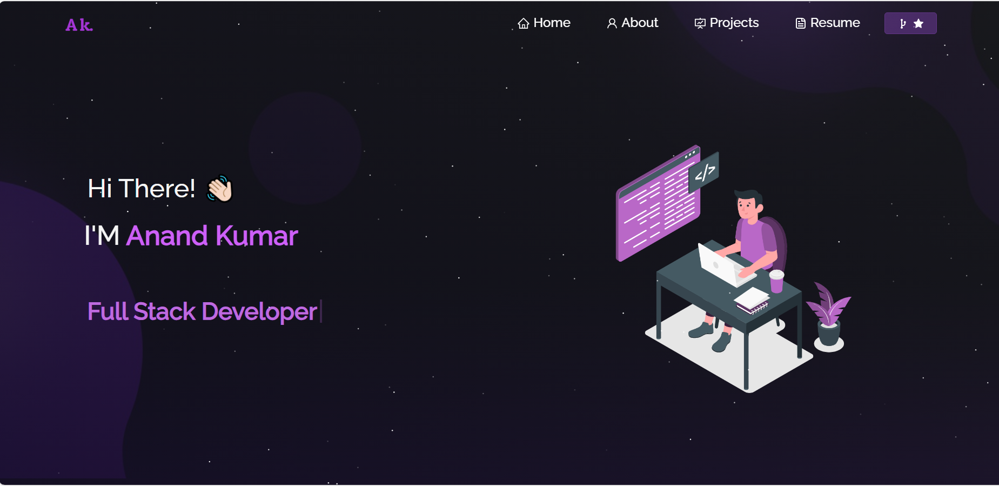

# 🚀 Anand Kumar - Personal Portfolio

Welcome to my Personal Portfolio Website! This project showcases my skills, projects, experience, and achievements as a Full Stack Developer.

  

# 🌐 Live Demo

🔗 [Portfolio Website](https://anandportfolio1.netlify.app/)

## 📌 About the Portfolio

This portfolio is built to provide insights into my expertise in Frontend and Backend development. It includes:

✅ Introduction – About me, my skills, and my work experience

✅ Projects Section – Showcasing my top projects with live demos & GitHub links

✅ Tech Stack – Technologies I use in development

✅ Experience – My internships and work experience

✅ Contact Section – A way to connect with me

## 🛠️ Tech Stack Used

This portfolio is built using the following technologies:

-Frontend: React.js, Material-UI, Tailwind CSS

-Backend: Node.js, Express.js (if applicable)

-Database: MongoDB / MySQL (if applicable)

-Deployment: Vercel / Netlify

-Version Control: Git & GitHub

## 🚀 How to Run the Portfolio Locally

1️⃣ Clone the Repository

git clone https://github.com/anand-repo/my-portfolio.git

cd my-portfolio

2️⃣ Install Dependencies

npm install

3️⃣ Run the Project

npm start

The project will be running at http://localhost:3000/.

## 🎨 Features of My Portfolio

✔️ Interactive UI: Smooth animations and responsive design

✔️ AboutUs Section: Description about me and my profession.

✔️ Skills Section: Technical and Non-technical skills sections.

✔️ Resume Download: A section to download my resume

✔️ Project Showcase: Highlights my best projects with live demo links

✔️ Experience Section:- A details explanation of my experience.

## 🏆 My Achievements & Certifications

Bronze Medalist in Web Technology (State Level Competition - Bihar)

Frontend Developer (React) Certification - HackerRank

Core Java Certification - HackerRank

Java for Placements - CodeTantra

## 📩 Contact Me

📧 Email: work.anandkr@gmail.com
🔗 LinkedIn: linkedin.com/in/anand-kumar0
📂 GitHub: github.com/Anand98013

